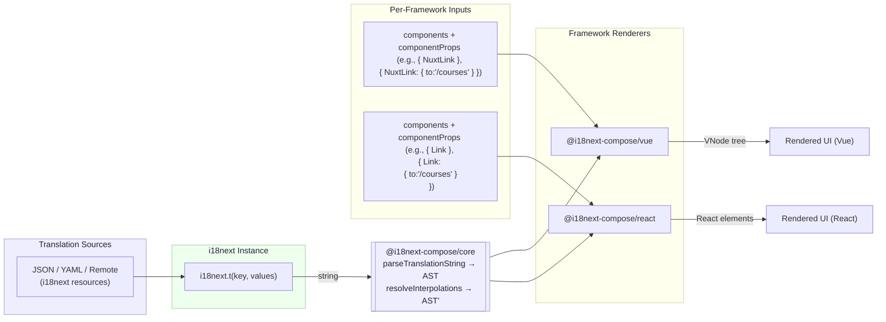
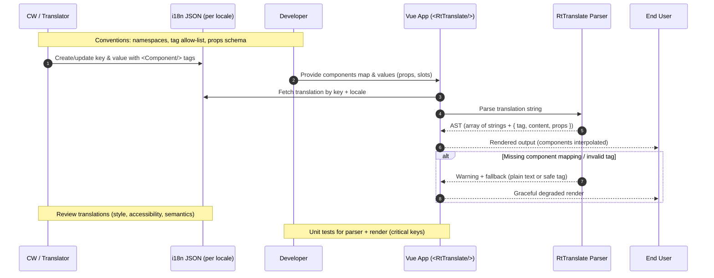

```mermaid
flowchart LR
  subgraph T["Translation Sources"]
    F1["JSON / YAML / Remote <br />(i18next resources)"]
  end

  subgraph I18N["i18next Instance"]
    I["i18next.t(key, values)"]
  end

  F1 --> I

  %% Keep the whole label inside the quotes; use <br/> for new lines
  C[["@i18next-compose/core<br/>parseTranslationString → AST<br/>resolveInterpolations → AST'"]]

  subgraph FW["Framework Renderers"]
    V["@i18next-compose/vue<br /><RtTranslate>"]
    R["@i18next-compose/react<br /><Trans>"]
  end

  I -->|string| C
  C --> V
  C --> R

  subgraph Inputs["Per-Framework Inputs"]
    VC["components + componentProps <br />(e.g., { NuxtLink }, <br />{ NuxtLink: { to:'/courses' } })"]
    RC["components + componentProps <br />(e.g., { Link }, <br />{ Link: <br />{ to:'/courses' }<br /> })"]
  end

  VC --> V
  RC --> R

  V -->|VNode tree| OUTV["Rendered UI (Vue)"]
  R -->|React elements| OUTR["Rendered UI (React)"]

  classDef k fill:#eef,stroke:#99c,stroke-width:1px,color:#223;
  classDef s fill:#efe,stroke:#9c9,stroke-width:1px,color:#223;
  classDef r fill:#ffe,stroke:#cc9,stroke-width:1px,color:#223;

  class T k
  class I18N s
  class C k
  class FW r
  class Inputs r

```

```mermaid
flowchart LR
  subgraph T["Translators / CW"]
    T1["Define key names<br />(naming + namespaces)"]
    T2["Write translation values<br />with allowed <Component/> tags"]
    T3["Submit for review"]
  end

  subgraph D["Developers"]
    D1["Define component allow-list<br />& props schema"]
    D2["Provide components map<br />{TagName: props}"]
    D3["Add parser/render tests"]
  end

  subgraph R["Runtime (App)"]
    R1[Fetch i18n JSON by key/locale]
    R2[Parse string → AST]
    R3[Render AST → Vue nodes]
    R4[Fallbacks for unknown tags/props]
  end

  subgraph Q["QA / Review"]
    Q1["Preview in staging"]
    Q2["Check accessibility & copy"]
  end

  %% Flow
  T1 --> T2 --> T3 --> D1
  D1 --> D2 --> D3 --> R1
  R1 --> R2 --> R3 --> R4 --> Q1 --> Q2

  %% Notes
  click D1 "https://example.com" "_blank"
```

```mermaid
sequenceDiagram
    autonumber
    participant CW as CW / Translator
    participant Repo as i18n JSON (per locale)
    participant Dev as Developer
    participant App as Vue App (<RtTranslate/>)
    participant Parser as RtTranslate Parser
    participant User as End User

    Note over CW,Dev: Conventions: namespaces, tag allow-list, props schema

    CW->>Repo: Create/update key & value with <Component/> tags
    Dev->>App: Provide components map & values (props, slots)
    App->>Repo: Fetch translation by key + locale
    App->>Parser: Parse translation string
    Parser-->>App: AST (array of strings + { tag, content, props })
    App-->>User: Rendered output (components interpolated)

    alt Missing component mapping / invalid tag
      Parser-->>App: Warning + fallback (plain text or safe tag)
      App-->>User: Graceful degraded render
    end

    Note over CW,Repo: Review translations (style, accessibility, semantics)
    Note over Dev,App: Unit tests for parser + render (critical keys)
```
